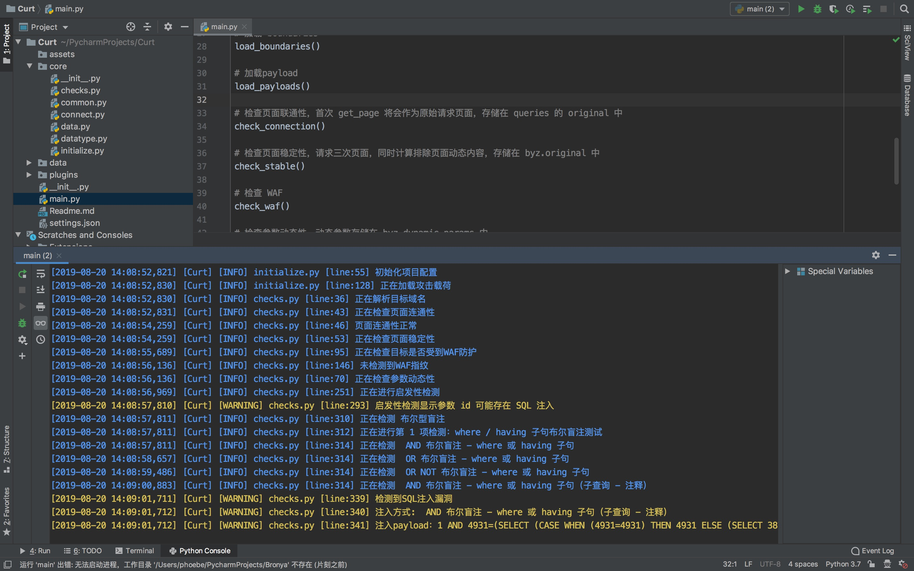

## 给人类看的ReadMe

>  姓名：Curt
>
>  年龄：7岁
>
>  性格：性情温和
>
>  技能：扫描SQL注入
>
>  朋友：Elena（邻居）
>
>  家人：Alisa（双胞胎妹妹）

Curt是一个“*初升的太阳*”，不会太多的东西，也没见过什么市面

但是他带着**渴望**的眼睛来到这个世界，想要发光，照亮一片大地

他性格很好，与妹妹一样

Curt经常与Alisa争吵，究竟谁是父母最爱的孩子，也会常常因为误报而自责

Curt经常带着妹妹去一些**自己搭建的**没有防护的站逛逛，或者直接去“迪士尼”——**靶场**玩上一天

Curt很努力，想要带着妹妹一起成长

加油

## ReadMe For Programmer

CurtSQLInjector is written in imitation of sqlmap, barely usable

### Usage

config in setting.py, run main.py

### Features

Too lazy to write,see it yourself.

### Screenshots

Scanning

